# Reinforcement Learning Portfolio Optimization — NIFTY 50

An end-to-end quantitative trading research pipeline for Indian equities. A **Proximal Policy Optimization (PPO)** agent learns to dynamically allocate capital across 10 NIFTY 50 stocks, benchmarked against seven rule-based strategies and a supervised ML baseline under a rigorous, lookahead-free evaluation framework.

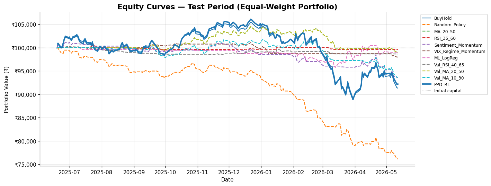

---

## Table of Contents

- [Overview](#overview)
- [Architecture](#architecture)
- [Results](#results)
- [Pipeline](#pipeline)
- [Key Design Decisions](#key-design-decisions)
- [Features](#features)
- [Setup & Usage](#setup--usage)
- [Configuration](#configuration)
- [Project Structure](#project-structure)
- [Limitations & Future Work](#limitations--future-work)

---

## Overview

Portfolio management is framed as a **Markov Decision Process** solved with PPO (Stable-Baselines3). The agent observes a 162-dimensional feature panel at each trading step and outputs a continuous allocation vector across 10 NIFTY 50 stocks + cash. It is evaluated against seven rule-based baselines and a logistic regression baseline under identical transaction cost and slippage assumptions.

**Universe:** `RELIANCE` · `HDFCBANK` · `ICICIBANK` · `INFY` · `TCS` · `BHARTIARTL` · `ITC` · `LT` · `SBIN` · `HINDUNILVR`

**Data:** 2018–present via yfinance · India VIX · NSEI benchmark

---

## Architecture

```
Raw OHLCV (yfinance)
        │
        ▼
  Feature Engineering          per-ticker groupby → no cross-ticker leakage
  (14 technical + VIX-proxy)   ret, MA ratios, RSI, MACD, BB, ATR, momentum,
                                sentiment_proxy, dispersion_zscore, VIX regime
        │
        ├──────────────────────────────────────────────────┐
        ▼                                                  ▼
  Rule-Based Strategies                           PPO Environment
  (BuyHold, MA, RSI, Breakout,                   MultiStockPPOEnv (Gymnasium)
   MomentumPullback, Sentiment-                  · Continuous action space (n+1)
   Momentum, VIX-Regime-Momentum,               · Softmax portfolio weights
   LogReg)                                       · Scaled reward: log_ret
        │                                          − drawdown_pen − turnover_pen
        │                                          − downvol_pen − highVIX_pen
        └──────────────────┬───────────────────────────────┘
                           ▼
              Equal-Weight Portfolio Backtester
              (per-ticker capital slice, 10 bps TC + 5 bps slippage)
                           │
                           ▼
              Performance Metrics + Walk-Forward + Risk Grid
```

---

## Results

### Strategy Comparison — Test Split

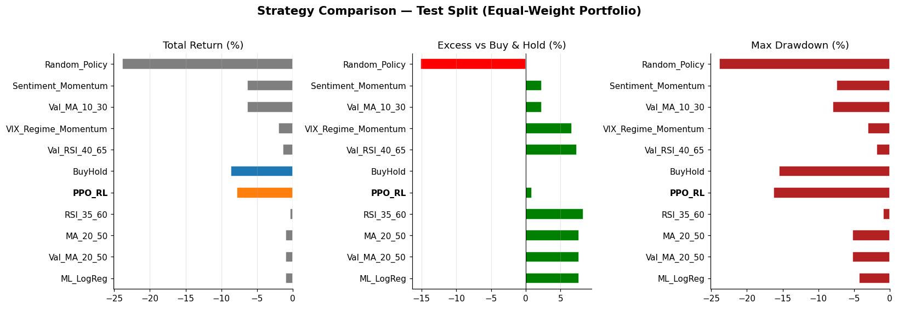

### Equity Curves


### Drawdown

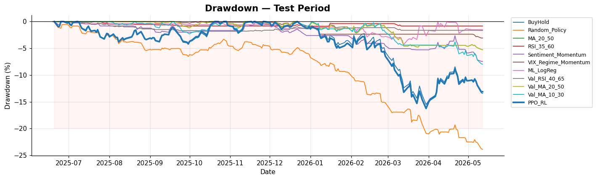

### Risk-Return Scatter

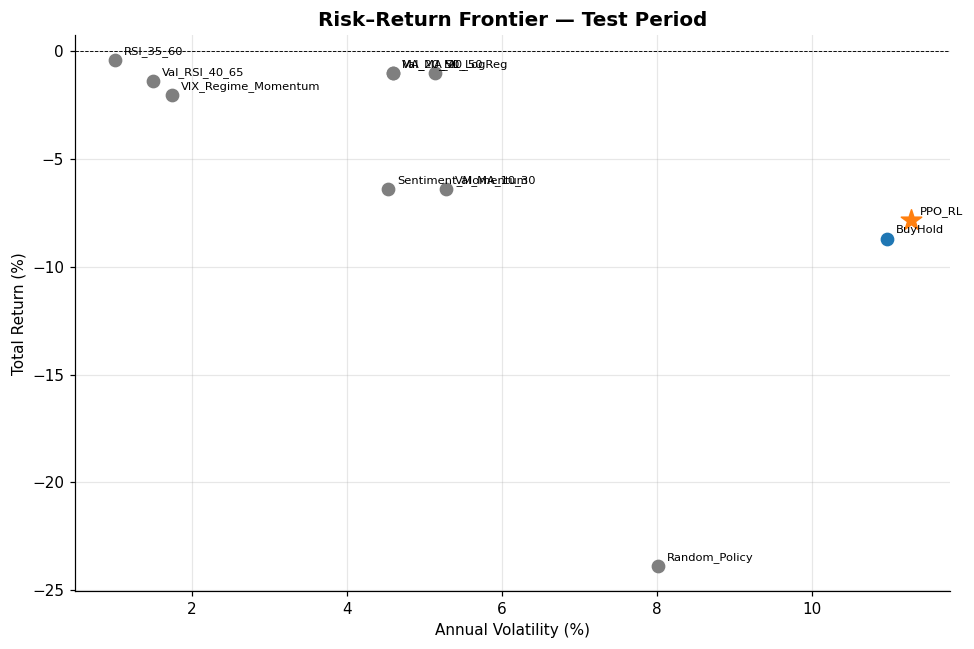

### Rolling Sharpe Ratio

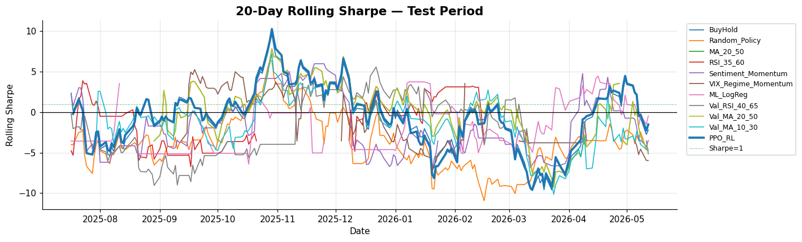

### Walk-Forward Returns by Window

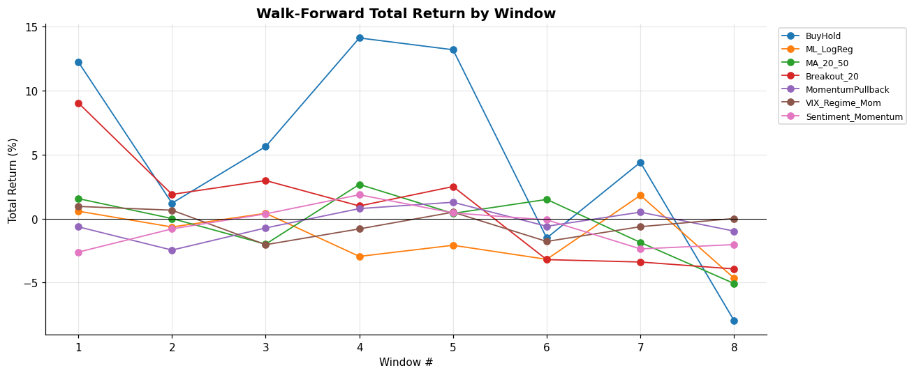

### Risk Sensitivity — Stop-Loss × Take-Profit Grid (MA_20_50)

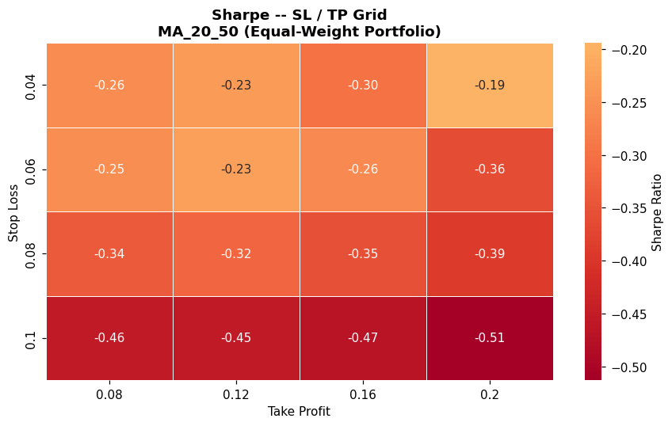

### VIX & Relative Strength

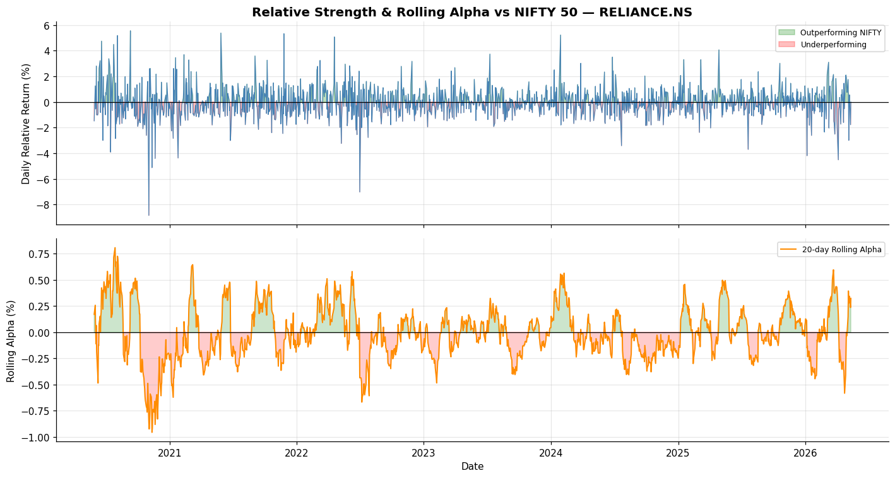

### Sentiment Heatmap (VIX-Proxy)

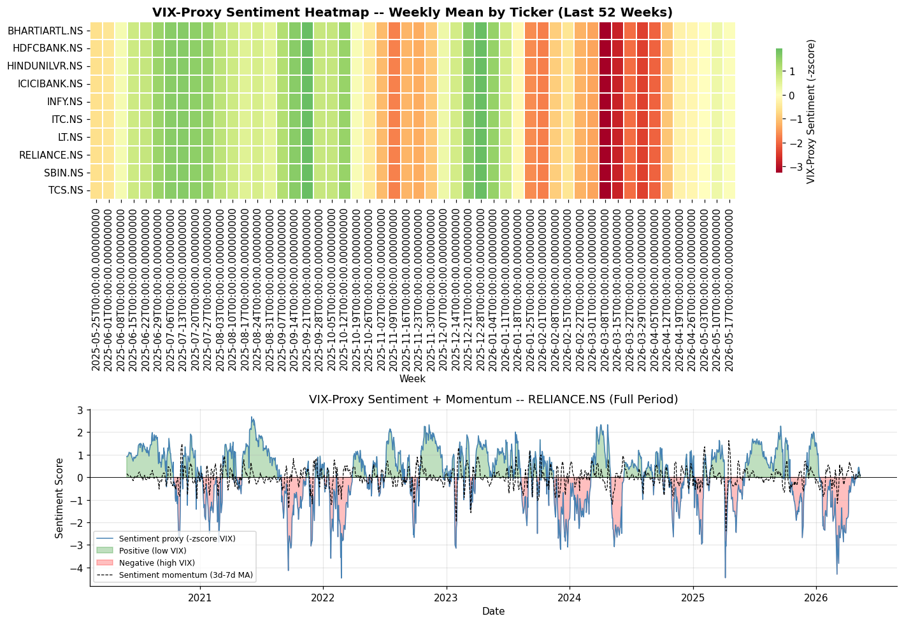

### Portfolio Allocation Stack

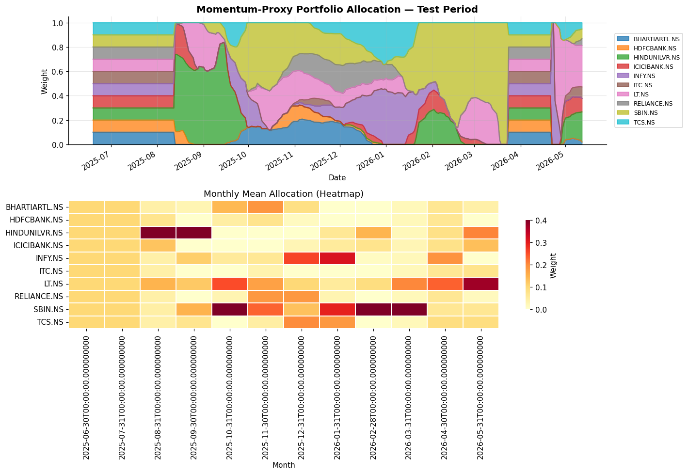

### Best Strategy Positions

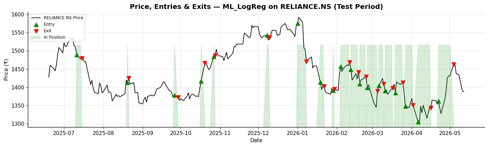

### Technical Indicators — RELIANCE.NS

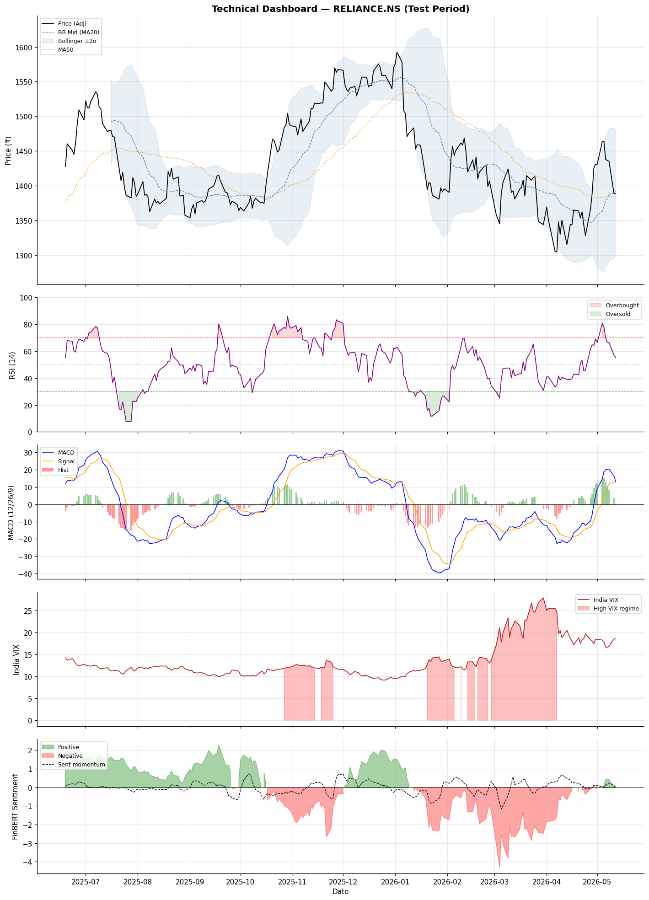

---

## Pipeline

| # | Section | Key design choice |
|---|---|---|
| 1 | **Setup** | Frozen `Config` dataclass; reproducible seed |
| 2 | **Sentiment** | VIX-proxy replaces FinBERT (100% date coverage vs 0%) |
| 3 | **Data Ingestion** | Unified `price` column; macro + India VIX + NSEI benchmark |
| 4 | **Feature Engineering** | Per-ticker `groupby` eliminates cross-ticker leakage |
| 5 | **Baseline Strategies** | Per-ticker signals aggregated into portfolio backtest |
| 6 | **Portfolio Backtester** | Equal-weight multi-stock; identical TC/slippage for all |
| 7 | **Performance Metrics** | Sharpe, Sortino, IR, VaR, CVaR, per-ticker signal accuracy |
| 8 | **RL Feature Sets & Scaling** | Scaler fit on train only; 4 ablation subsets |
| 9 | **PPO Environment** | Multi-stock continuous allocation; missing-price flag |
| 10 | **PPO Training** | Hyperparam search; feature ablation; walk-forward; Sharpe checkpoint |
| 11 | **Strategy Comparison** | Validation-selected params applied to untouched test split |
| 12 | **Results & Visualisations** | 12 charts covering return, risk, sentiment, allocation |
| 13 | **Walk-Forward Backtesting** | Date-sliced windows; per-window buy-hold benchmark |
| 14 | **Risk Sensitivity** | 4×4 SL/TP grid; Sharpe heatmap on MA_20_50 |
| 15 | **Summary & Export** | Leaderboard + CSV export |

---

## Key Design Decisions

### Sentiment: VIX-proxy replaces FinBERT

Yahoo Finance returns only ~2 weeks of recent headlines. FinBERT produced **0% non-zero coverage** across the training window — a silent dead feature confirmed by ablation. Replaced with two economically-motivated proxies with full date coverage:

```
sentiment_proxy   = -zscore(india_vix, 60d)   # high VIX = fear = negative
dispersion_zscore = zscore(cross_sectional_std(5d_returns), 60d)  # market stress
```

### Reward shaping

```
r_t = log(V_t / V_{t-1})
    − 0.04  × |drawdown_t|
    − 0.02  × σ_downside
    − 0.0002 × n_trades_t
    − 0.0002 × 𝟙[high_vix_regime ∧ holding]
```

Coefficients were calibrated iteratively — initial values caused permanent cash-hoarding; halved to allow non-trivial policy learning while retaining risk control.

### SharpeCheckpointCallback

PPO policies can peak mid-training then regress. A custom callback evaluates validation Sharpe every 25K steps, saves weights on improvement, and restores the best checkpoint after `learn()`. The deployed model is the best policy seen during training, not the final iterate.

### Lookahead-free evaluation

- Scaler fitted on train split only
- Walk-forward windows sliced by unique trading dates (not calendar days)
- Per-window buy-hold baseline in PPO walk-forward controls for regime difficulty
- No shuffling at any stage

### `_signal_fn` dispatcher fix

`VIX_Regime_Momentum` was registered in `FIXED_STRATS` but missing from the dispatcher — it silently returned all-zero signals. Fixed so the strategy actually executes in both the test comparison and walk-forward.

---

## Features

**Technical (per ticker)**

| Feature | Description |
|---|---|
| `ret` | Daily log return |
| `ma_ratio` | Price / MA20 |
| `trend_20_50` | MA20 / MA50 |
| `rsi` | 14-day RSI |
| `macd_hist` | MACD histogram |
| `bb_position` | (Price − lower) / (upper − lower) |
| `bb_width` | BB width / MA20 |
| `atr_pct` | ATR(14) / price |
| `momentum_5` | 5-day price return |
| `momentum_20` | 20-day price return |
| `volume_change` | Volume / 20d MA volume |

**Macro / VIX**

| Feature | Description |
|---|---|
| `india_vix` | India VIX level |
| `high_vix_regime` | VIX > rolling 60th percentile |
| `dispersion_zscore` | Cross-sectional return std, z-scored |
| `sentiment` | −zscore(india_vix, 60d) |

---

## Setup & Usage

### Install

```bash
pip install -r requirements.txt
```

Or on Colab/Kaggle, the notebook installs dependencies in Cell 2 automatically.

### Run

Open `nifty50_rl_portfolio_optimization.ipynb` and run all cells. All config is in the `Config` dataclass (Cell 4) — no CLI arguments needed.

### Toggle experiment scope

```python
# Config (Cell 4)
run_ppo              = True   # master PPO switch
run_ppo_tuning       = True   # 3-candidate hyperparam search
run_ppo_ablation     = True   # 4-subset feature ablation
run_ppo_walk_forward = True   # walk-forward on PPO policy
```

Set all to `False` to run only rule-based strategies and skip PPO training entirely.

### Strip outputs before committing

```bash
pip install nbstripout
nbstripout nifty50_rl_portfolio_optimization.ipynb
```

---

## Configuration

```python
@dataclass(frozen=True)
class Config:
    # Universe
    tickers           = ('RELIANCE.NS', 'HDFCBANK.NS', ...)  # 10 NIFTY 50 stocks
    benchmark_ticker  = "^NSEI"
    vix_ticker        = "^INDIAVIX"
    start_date        = "2018-01-01"

    # Capital
    initial_cash      = 1_000_000   # ₹10L
    transaction_cost  = 0.001       # 10 bps
    slippage          = 0.0005      # 5 bps

    # PPO
    ppo_timesteps          = 250_000
    ppo_tuning_timesteps   = 50_000
    ppo_ablation_timesteps = 50_000

    # Reward coefficients
    rew_drawdown_penalty  = 0.04
    rew_downvol_penalty   = 0.02
    rew_turnover_penalty  = 0.0002
    rew_highvix_penalty   = 0.0002

    # Flags
    run_ppo              = True
    run_ppo_tuning       = True
    run_ppo_ablation     = True
    run_ppo_walk_forward = True
```

---

## Project Structure

```
nifty50_rl_portfolio_optimization.ipynb   Main notebook (15 sections, 44 cells)
METHODOLOGY.md                            MDP formulation, reward design, evaluation
requirements.txt
.gitignore
assets/                                   Result plots (12 charts)
results/                                  CSV outputs (generated at runtime)
  financial_metrics.csv
  walk_forward_metrics.csv
  risk_sensitivity.csv
  trades_<strategy>.csv
  ppo_ablation.csv
```

---

## Limitations & Future Work

**Current limitations**

- 250K training steps is adequate for proof-of-concept; a production system would need 2–5M steps with GPU acceleration
- VIX-proxy sentiment is market-wide, not ticker-specific — a historical news API (GDELT, NewsAPI) would add cross-sectional signal
- Fixed 10 bps + 5 bps TC model understates real Indian market costs (STT, stamp duty, bid-ask spread)
- Results reported for a single seed (`seed=42`); production evaluation would average over 5–10 seeds

**Planned extensions**

- Ticker-specific sentiment via GDELT or NewsAPI historical provider
- Recurrent policy (LSTM) to capture temporal dependencies in portfolio state
- Kelly criterion position sizing as post-processing on PPO allocations
- Dockerised environment + GitHub Actions CI to rerun on fresh data
- Adaptive walk-forward window sizing based on volatility regime detection
