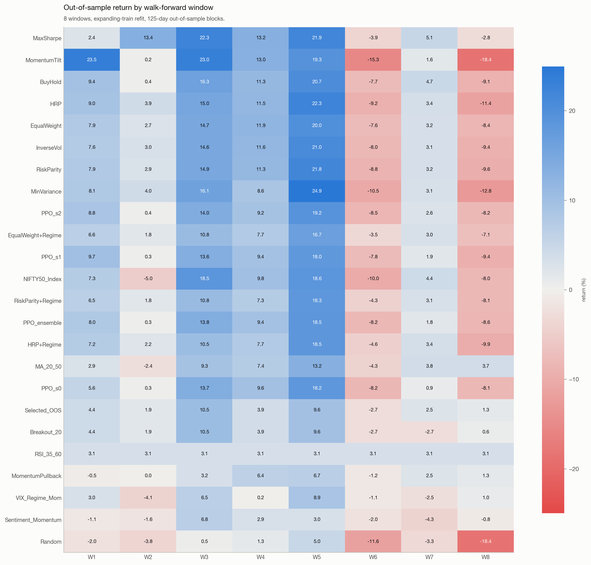
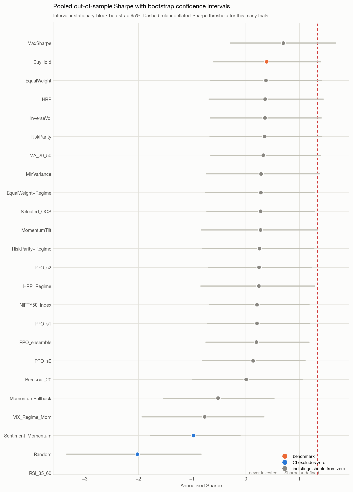
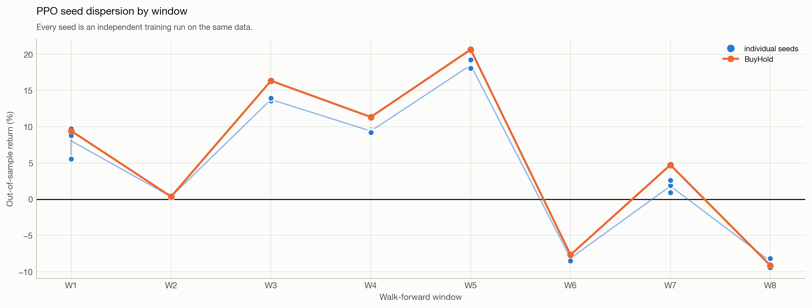
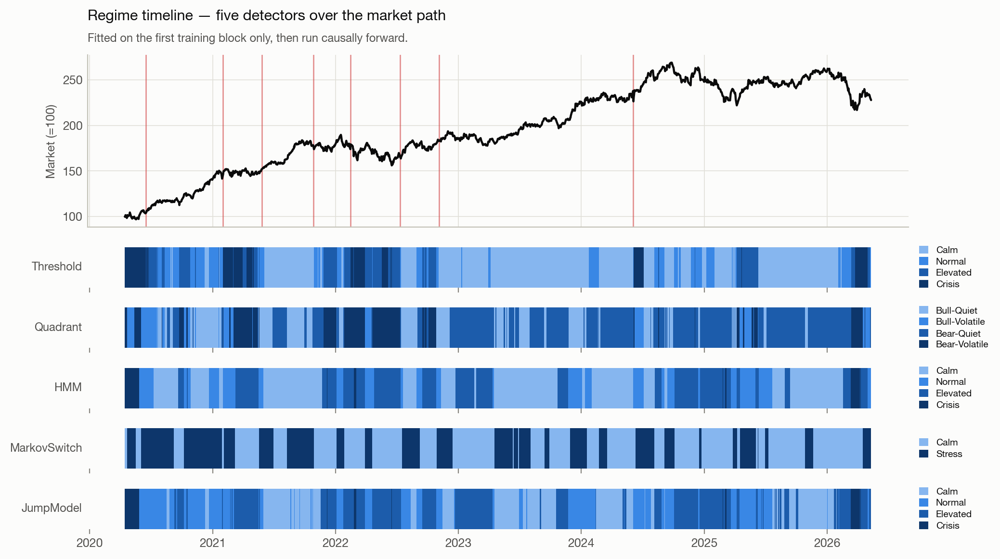
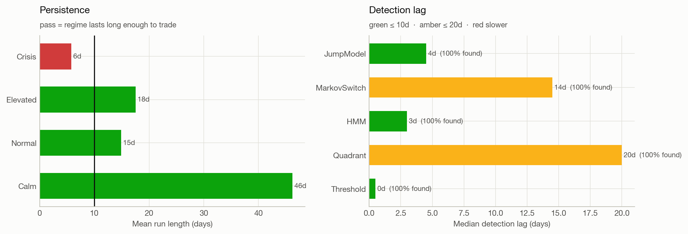

# Regime-Aware Portfolio Research — NIFTY 50

A quantitative research pipeline for Indian equities, built around **causal regime
detection** and **rolling walk-forward evaluation**. Five regime models run in parallel;
the regimes are validated before anything is conditioned on them; and every result is
reported with bootstrap confidence intervals and a multiple-testing correction.



**Start here: [`notebooks/01_walkthrough.ipynb`](notebooks/01_walkthrough.ipynb)** — the
narrative version, runs in ~60s and imports from `src/` so it cannot drift from the code.
**Full numbers: [RESULTS.md](RESULTS.md)**, generated by the pipeline. **Plan of record:
[ROADMAP.md](ROADMAP.md)**.

---

## Why a single train/test split is not an evaluation

This is the most important thing in the repository.

An earlier version used a 70/15/15 chronological split. That produces exactly **one**
out-of-sample window, and whichever regime it lands in *is* the result. Here it landed on
a drawdown, and the conclusion was "every strategy lost money" — true of that window, and
nearly uninformative about the strategies.

Same code, same data, same strategies, evaluated as a deployed model would be:

| | Single split (1 window, 222 days) | **Walk-forward (8 windows, 992 days)** |
|---|---|---|
| Strategies with positive return | 0 of 18 | **18 of 19** |
| Best pooled Sharpe | −0.75 | **+0.73** |
| Benchmark (BuyHold) | −9.3% | **+50.9%** |

The walk-forward refits on an expanding history, trades the next 125-day block with
parameters frozen, rolls forward, and chains every out-of-sample block into one continuous
track record. Nothing is chosen using data from the block it is scored on.

---

## Results

| Strategy | Pooled OOS return | Pooled Sharpe | Windows positive | Beat benchmark |
|---|---|---|---|---|
| **MaxSharpe** | **+94.8%** | **0.73** | 75% | **75%** |
| BuyHold *(benchmark)* | +50.9% | 0.42 | 75% | — |
| EqualWeight | +50.5% | 0.41 | 75% | 38% |
| HRP | +48.3% | 0.38 | 75% | 38% |
| Selected_OOS *(chosen on train each window)* | +35.5% | 0.31 | **88%** | 38% |
| **PPO_ensemble** *(3 seeds, retrained per window)* | +41.8% | 0.28 | 75% | 25% |
| Random | −26.2% | −2.00 | 38% | 0% |

`windows_beating_benchmark` matters more than the pooled return: a strategy that beats
buy-and-hold in 3 of 8 windows is one that had a good window, not a strategy that beats
buy-and-hold.

### …and does any of it survive multiple testing?



- **PBO = 0.21** — the in-sample winner lands in the bottom half out-of-sample about a
  quarter of the time. Well under the 0.5 that means selection is noise.
- **White's Reality Check p = 0.248** — the best strategy does **not** beat buy-and-hold
  at conventional significance once the size of the search is accounted for.
- **Deflated Sharpe Ratio of the winner = 0.111** over 46 effective trials.
- Only **2 of 23** confidence intervals exclude zero.

The honest summary: the record is positive and reasonably consistent, but no strategy is
statistically distinguishable from the passive benchmark. Publishing the leaderboard
without those three numbers beside it would overstate every row.

---

## The RL agent learned to be buy-and-hold

PPO is retrained from scratch in every window — scaler refit on that window's training
block, an inner validation split for the Sharpe checkpoint, three independent seeds.



It underperforms: **+41.8% pooled against buy-and-hold's +50.9%**, beating the benchmark
in only 25% of windows. But the *diagnosis* is the useful part:

| | Correlation with BuyHold | Mean exposure |
|---|---|---|
| **PPO_ensemble** | **0.993** | **99.2%** |
| EqualWeight | 0.980 | 96.1% |
| MaxSharpe | 0.770 | 44.6% |

The agent converged to holding the basket essentially all the time, then paid turnover
for it — behind the benchmark in 6 of 8 windows, mean −0.82pp, best-case edge +0.15%. It
is a costly reimplementation of the benchmark, not a strategy.

**And that is not seed noise.** Median within-window seed standard deviation is **0.55%**;
in one window the three seeds land within 0.06% of each other. Three independent runs
agreeing that closely means the optimiser found what the reward was asking for — so the
fix is not "train longer", it is to change the question. The reward is close to maximising
log wealth with weak penalties, and full investment is very nearly its correct answer.

The original project reported a single seed and listed that as a limitation. This is what
checking it looks like.

---

## Causal regime detection

Every online detector satisfies one contract:

```
predict_online(X[:t]).iloc[-1] == predict_online(X).iloc[t-1]
```

`tests/test_regimes.py` verifies it by **brute force** — recomputing every prefix and
comparing against the full-sample run, for all five detectors.

This is where regime work usually breaks silently. `hmmlearn.predict()` runs Viterbi over
the whole sequence; `predict_proba()` returns forward–backward *smoothed* posteriors. Both
read the future, and both are the obvious methods to reach for. The Gaussian HMM here
implements its own forward filter, so the guarantee is structural. A dedicated test
asserts the smoothed and filtered paths genuinely differ, so the distinction cannot be
optimised away later.



### The models are validated before anything is built on them



- **Persistence** — mean run 20.6 days. A model that flips every three days is
  untradeable after costs, however well it fits.
- **Detection lag** — days from a retrospectively established break to the online detector
  reacting. Threshold rules react in 2 days but flip constantly; the HMM's transition
  prior buys persistence and pays ~10 days of lag. Measured, not assumed.
- **Refit stability** — mean Cohen's κ = 0.70 against the previous fit across walk-forward
  boundaries. Low agreement would mean "state 0" changes meaning between refits, making
  regime-conditioned results incomparable across time.

Ground-truth breaks come from a full-sequence segmenter that is deliberately **not** a
regime detector — it sees the whole series, so it can never be traded, which is exactly
what makes it a fair yardstick. The retrospective/online split is enforced at the type
level.

### An honest negative result

**The regime exposure overlay does not pay for itself.** Across all eight windows it
reduced drawdown but cost both return and risk-adjusted return: `HRP` +48.3% pooled
against `HRP+Regime` +38.8%. De-risking in elevated-volatility regimes means being
underweight through the rebounds that follow them, and over eight windows that cost more
than the drawdown it saved.

The regime layer earns its place as **diagnosis** — the timeline, the conditional
performance table, the stratified evaluation — not as an exposure signal. Reported as
measured.

---

## Architecture

**[`docs/CODE_MAP.md`](docs/CODE_MAP.md)** walks through this module by module — what each
file is responsible for, where to start reading for a given question, and a glossary of
every term the code uses without defining.

```
yfinance ──► data ─────────► pinned end_date, parquet/CSV cache, auto_adjust
                │            per-ticker ffill (no cross-ticker leakage)
                ▼
            features ──────► Wilder RSI/ATR, targeted warm-up
                │
      ┌─────────┴──────────┐
      ▼                    ▼
  regimes/            strategies/
    features            signals      8 rule-based, precomputed indicators only
    base (contract)     allocators   EqualWeight · InverseVol · MinVar · MaxSharpe
    threshold                        RiskParity · HRP · MomentumTilt
    hmm (own filter)    meta         exposure overlay · regime routing
    jump                     │
    changepoint (retro)      ▼
    evaluate           backtest/
      │                  engine   per-ticker buckets, stop-loss lockout
      │                  weights  pooled cash, sells-before-buys
      │                  costs    flat | full Indian charge stack + sqrt impact
      └────────┬────────────┘
               ▼
        validation/walkforward ──► expanding refit, frozen OOS blocks, pooled record
               ▼
          metrics/  performance · stats (DSR, PBO, SPA, block bootstrap)
               ▼
          report/   theme · figures · build → RESULTS.md

  envs/  panel (dense NumPy) · core (pure sim) · rewards · multistock (Gym adapter)
```

---

## Quick start

```bash
pip install -r requirements.txt
python3 -m pytest tests/ -q                    # 95 tests, ~4s
python3 scripts/run_pipeline.py                # ~20 min → RESULTS.md, results/, assets/v2/
python3 scripts/build_notebook.py --execute    # regenerate the notebook from those artefacts
```

Run them in that order — `build_notebook.py` reads what the pipeline wrote. Add `--no-rl`
to the pipeline for a ~90 second run that skips only PPO.

`DataConfig.end_date` is pinned, so a rerun on any date reproduces the published figures
exactly. Pass `end_date=None` for live data.

### Optional: LLM regime commentary

Each detected regime episode gets a factual description computed from its own statistics —
no model, deterministic, always correct. Passing an OpenRouter key additionally attaches
what was actually happening in the market during that episode:

```bash
export OPENROUTER_API_KEY=...            # never passed as a CLI argument
python3 scripts/run_pipeline.py --narrate-llm
```

Strictly presentation. It is generated after the fact, written to its own artefact, and
**never enters a feature, an observation, or any model input** — `assert_no_narration_leak`
enforces that in CI against the real feature panel, because an LLM's weights encode what
happened *after* the period being described. Without the key the pipeline behaves
identically; the commentary is the only thing that changes. No extra dependency — the
provider uses `urllib` from the standard library.

---

## What was fixed

This replaces a single 44-cell notebook. Twenty correctness bugs were found and fixed,
each with a test that fails against the original behaviour. The most consequential:

| Bug | Effect on published numbers |
|---|---|
| Indicator warm-up recomputed on the split slice | MA/breakout forced flat for the first 50 bars of every window. On a clean uptrend the original was long **11 of 60** sliced bars where it should have been long on all 60. |
| Stop-loss re-entered on the next bar | A risk exit set `cur_sig=0`, so entry re-fired immediately if the signal persisted. Stops cost round-trips and protected nothing — which is why the 4×4 SL/TP grid came out flat. |
| `add(..., fill_value=0)` on ragged dates | A ticker missing one date contributed *zero equity* rather than carried equity. Measured: equity std of 4,472 on a series that should be flat. |
| "BuyHold" benchmark carried a 6% stop and 12% target | `run_portfolio_backtest` defaults applied to the passive benchmark. Worth 11.9 points (−9.30% vs +2.60%); every `benchmark_excess_return` was measured against a mislabelled stop-loss strategy. |
| RL env: one interleaved sell/buy pass | A sale of ticker 9 could not fund a purchase of ticker 0, so target weights were unreachable and early tickers got funding priority. The agent could not execute its own policy. |
| RL env: `self.weights = target_w` | The agent observed what it *asked for*, not what it got — 11 of 172 observation dimensions were fiction. |
| Information ratio annualised twice | The two `√252` cancelled; every published IR was ~15.9× too small. |
| `signal_accuracy` used aggregate positions | Measured portfolio participation, not signal quality — which is why every strategy landed at 44–47%. |
| Adjusted close mixed with raw High/Low | True range differenced two price scales; a bonus issue injected a ~50% spike into `atr_pct`. |
| Cash earned 0% | At a 6.5% risk-free rate this penalised selective strategies twice. `MomentumPullback` returns +1.8% and is a **4.7-point loss** in real terms. |
| RSI deleted rows | NaN on 14 consecutive up-days, then a blanket `dropna()` — silently removing observations during the strongest momentum runs. |
| Random baseline used one seed for all tickers | All ten names traded in lockstep; that concentration, not randomness, produced its −23.88% print. |

Five more were found *while building this*, all pinned by tests: a degenerate all-cash
Sharpe of 2.1e13, a bootstrap CI that double-subtracted the risk-free rate (putting point
estimates outside their own intervals), the mislabelled benchmark above, an
uninitialised-EW-moment blow-up in the differential Sharpe reward, and a diverging colour
ramp that painted losses blue.

Full inventory: [ROADMAP.md](ROADMAP.md).

---

## Not included

- **No PPO hyperparameter search.** One configuration, three seeds, 60k steps per window.
  A search needs its own nested validation split or it becomes the data-snooping problem
  the statistics section exists to measure.
- **Single seed for regime models.** The eight walk-forward refits are a partial
  substitute, not a seed sweep.
- **Flat cost model by default** (10 bps + 5 bps) so numbers stay comparable with the
  original. The full Indian charge stack is implemented as `CostConfig(model="india")`.

---

## Layout

```
src/nifty_rl/     config · data · features · regimes/ · strategies/ · backtest/
                  validation/ · metrics/ · envs/ · report/
notebooks/        01_walkthrough.ipynb (generated by scripts/build_notebook.py)
scripts/          run_pipeline.py · render_report.py · build_notebook.py
docs/             CODE_MAP.md — module-by-module guide and glossary
tests/            95 tests; every bug fix has one that fails against the original
assets/v2/        figures (light + dark) with a CSV twin beside each
results/          walk-forward tables, significance, regime diagnostics
RESULTS.md        generated by the pipeline
ROADMAP.md        plan of record
```

Figures ship in light and dark, each with the table behind it — a chart whose values are
reachable only by reading pixels is not a result.
