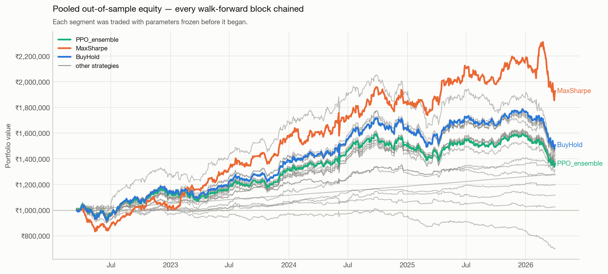
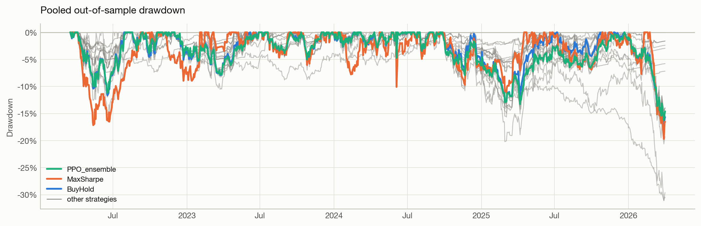
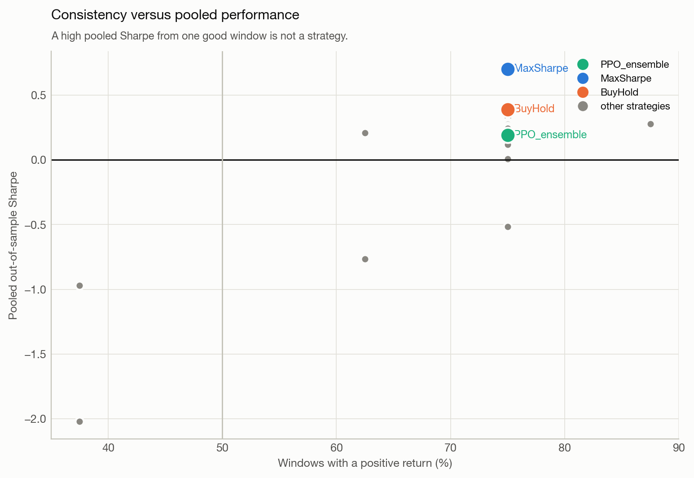
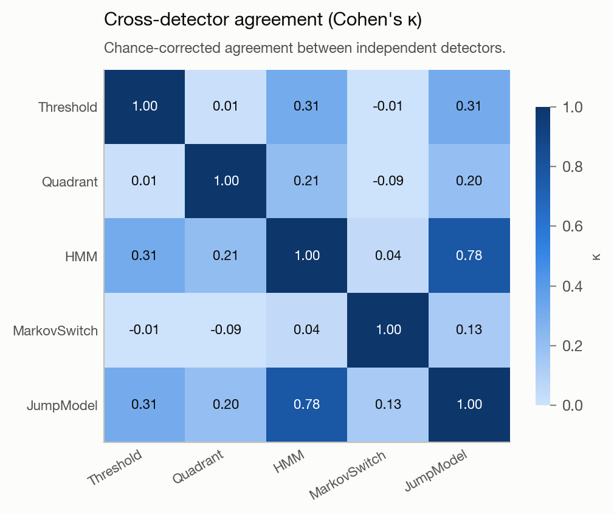
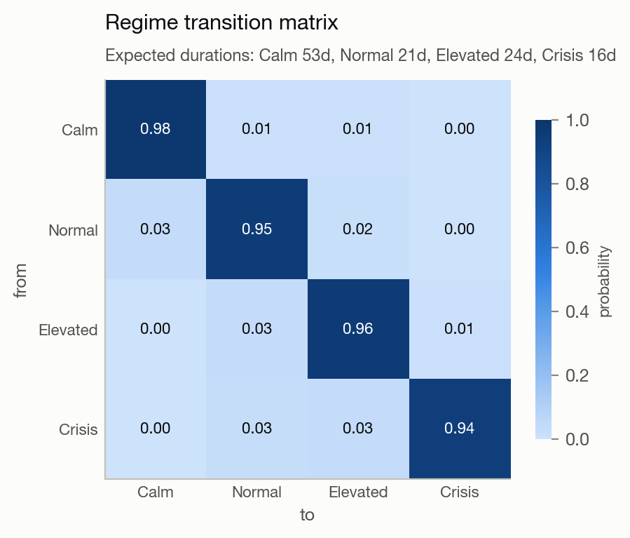
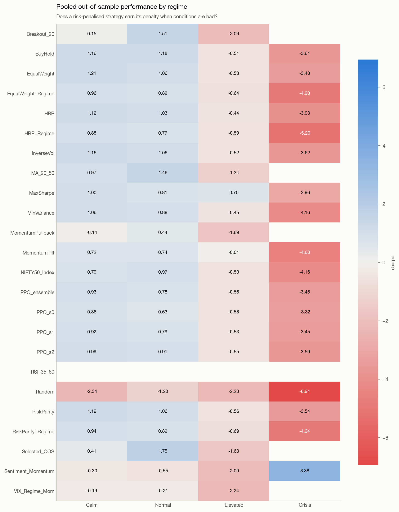

# Results

*Generated by the final cell of `notebooks/00_full_pipeline.ipynb`. Do not edit by hand.*

**Evaluation: rolling walk-forward, expanding train.**
8 out-of-sample windows ·
992 pooled out-of-sample trading days ·
2022-03-16 → 2026-04-02 ·
24 strategies · 47 effective trials.

---

## Why the evaluation changed

An earlier version of this analysis used a single 70/15/15 chronological split. That
produces exactly **one** out-of-sample window, and whichever regime it lands in *is* the
result. Here it landed on a drawdown, and the conclusion was that every strategy lost
money — which was true of that window and told you almost nothing about the strategies.

Under rolling walk-forward the same code, the same data and the same strategies produce a
different and far more informative answer:

| | Single split (1 window, 222 days) | Walk-forward (8 windows, 992 days) |
|---|---|---|
| Strategies with positive return | 0 of 18 | 23 of 24 |
| Best pooled Sharpe | −0.75 | 0.70 |
| Benchmark (BuyHold) | −9.3% | +50.9% |

Neither number is wrong. The first measured one bear market; the second measures a model
that refits on an expanding history, trades the next block with parameters frozen, and
rolls forward — which is what a deployed system actually does. **That is why a single
split is not an evaluation.**

Each window's parameters are chosen before the block it is scored on begins. The
out-of-sample blocks are chained into one continuous track record, and that pooled series
— not any individual window — is what carries a confidence interval.

| window | test_start | test_end |
|---|---|---|
| 1 | 2022-03-16 | 2022-09-15 |
| 2 | 2022-09-16 | 2023-03-16 |
| 3 | 2023-03-17 | 2023-09-18 |
| 4 | 2023-09-20 | 2024-03-22 |
| 5 | 2024-03-26 | 2024-09-26 |
| 6 | 2024-09-27 | 2025-03-27 |
| 7 | 2025-03-28 | 2025-09-29 |
| 8 | 2025-09-30 | 2026-04-02 |

---

## Walk-forward results


Reading across a row shows whether a strategy is consistent; reading down a column shows
which windows were hard for everything. A single test period hides both.

| strategy | final_value | profit | pooled_total_return | cagr | pooled_sharpe | windows_positive | windows_beating_benchmark | worst_window_return | mean_max_drawdown | mean_exposure |
|---|---|---|---|---|---|---|---|---|---|---|
| MaxSharpe | 1,928,146 | 928,146 | 92.8% | 18.2% | 0.70 | 75% | 88% | -3.9% | -10.8% | 44% |
| BuyHold | 1,507,648 | 507,648 | 50.8% | 11.0% | 0.39 | 75% | 0% | -9.1% | -8.6% | 98% |
| EqualWeight | 1,495,433 | 495,433 | 49.5% | 10.8% | 0.38 | 75% | 50% | -8.4% | -8.7% | 96% |
| HRP | 1,480,674 | 480,674 | 48.1% | 10.5% | 0.36 | 75% | 38% | -11.4% | -8.5% | 96% |
| InverseVol | 1,480,424 | 480,424 | 48.0% | 10.5% | 0.36 | 75% | 38% | -9.4% | -8.7% | 96% |
| RiskParity | 1,475,864 | 475,864 | 47.6% | 10.4% | 0.35 | 75% | 25% | -9.6% | -8.6% | 96% |
| MA_20_50 | 1,374,320 | 374,320 | 37.4% | 8.4% | 0.33 | 75% | 25% | -4.3% | -3.3% | 41% |
| MinVariance | 1,428,964 | 428,964 | 42.9% | 9.5% | 0.29 | 75% | 25% | -12.8% | -8.4% | 86% |
| EqualWeight+Regime | 1,399,555 | 399,555 | 40.0% | 8.9% | 0.28 | 75% | 38% | -7.1% | -6.5% | 96% |
| Selected_OOS | 1,352,164 | 352,164 | 35.2% | 8.0% | 0.28 | 88% | 38% | -2.7% | -2.9% | 31% |
| MomentumTilt | 1,445,316 | 445,316 | 44.5% | 9.8% | 0.28 | 75% | 38% | -18.4% | -11.4% | 62% |
| RiskParity+Regime | 1,384,770 | 384,770 | 38.5% | 8.6% | 0.26 | 75% | 38% | -8.1% | -6.4% | 96% |
| PPO_s2 | 1,396,799 | 396,799 | 39.7% | 8.9% | 0.25 | 75% | 25% | -8.5% | -8.3% | 99% |
| HRP+Regime | 1,377,673 | 377,673 | 37.8% | 8.5% | 0.24 | 75% | 25% | -9.9% | -6.5% | 96% |
| NIFTY50_Index | 1,380,807 | 380,807 | 38.1% | 8.5% | 0.21 | 62% | 25% | -10.0% | -9.6% | — |
| PPO_s1 | 1,372,504 | 372,504 | 37.3% | 8.4% | 0.21 | 75% | 12% | -9.5% | -8.4% | 99% |
| PPO_ensemble | 1,362,429 | 362,429 | 36.2% | 8.2% | 0.19 | 75% | 12% | -8.6% | -8.4% | 99% |
| PPO_s0 | 1,318,161 | 318,161 | 31.8% | 7.3% | 0.12 | 75% | 12% | -8.2% | -8.3% | 99% |
| Breakout_20 | 1,275,061 | 275,061 | 27.5% | 6.4% | 0.01 | 75% | 38% | -2.7% | -3.4% | 36% |
| MomentumPullback | 1,197,362 | 197,362 | 19.7% | 4.7% | -0.52 | 75% | 25% | -1.2% | -1.8% | 15% |
| VIX_Regime_Mom | 1,116,933 | 116,933 | 11.7% | 2.8% | -0.77 | 62% | 25% | -4.1% | -3.1% | 27% |
| Sentiment_Momentum | 1,025,244 | 25,244 | 2.5% | 0.6% | -0.97 | 38% | 25% | -4.3% | -4.2% | 29% |
| Random | 703,202 | -296,798 | -29.7% | -8.6% | -2.02 | 38% | 0% | -18.4% | -8.7% | 49% |
| RSI_35_60 | 1,281,333 | 281,333 | 28.1% | 6.5% | — | 100% | 38% | 3.1% | 0.0% | 0% |

`windows_beating_benchmark` matters more than the pooled return. A strategy that beats
buy-and-hold in 3 of 8 windows is not a strategy that beats buy-and-hold — it is one that
had a good window.







---

## Does any of it survive multiple testing?


| strategy | sharpe | sharpe_ci_lower | sharpe_ci_upper | ci_excludes_zero | dsr | cash_like |
|---|---|---|---|---|---|---|
| MaxSharpe | 0.70 | -0.29 | 1.68 | False | 0.108 | False |
| BuyHold | 0.39 | -0.60 | 1.40 | False | 0.031 | False |
| EqualWeight | 0.38 | -0.65 | 1.42 | False | 0.029 | False |
| HRP | 0.36 | -0.68 | 1.45 | False | 0.027 | False |
| InverseVol | 0.36 | -0.66 | 1.41 | False | 0.027 | False |
| RiskParity | 0.35 | -0.66 | 1.42 | False | 0.026 | False |
| MA_20_50 | 0.33 | -0.65 | 1.39 | False | 0.023 | False |
| MinVariance | 0.29 | -0.74 | 1.37 | False | 0.019 | False |
| EqualWeight+Regime | 0.28 | -0.75 | 1.29 | False | 0.019 | False |
| Selected_OOS | 0.28 | -0.73 | 1.28 | False | 0.018 | False |
| MomentumTilt | 0.28 | -0.83 | 1.35 | False | 0.019 | False |
| RiskParity+Regime | 0.26 | -0.81 | 1.27 | False | 0.017 | False |
| PPO_s2 | 0.25 | -0.70 | 1.23 | False | 0.015 | False |
| HRP+Regime | 0.24 | -0.84 | 1.28 | False | 0.015 | False |
| NIFTY50_Index | 0.21 | -0.68 | 1.18 | False | 0.013 | False |
| PPO_s1 | 0.21 | -0.72 | 1.19 | False | 0.013 | False |
| PPO_ensemble | 0.19 | -0.74 | 1.18 | False | 0.012 | False |
| PPO_s0 | 0.12 | -0.83 | 1.09 | False | 0.008 | False |
| Breakout_20 | 0.01 | -0.99 | 1.05 | False | 0.004 | False |
| MomentumPullback | -0.52 | -1.53 | 0.53 | False | 0.000 | False |
| VIX_Regime_Mom | -0.77 | -1.93 | 0.34 | False | 0.000 | False |
| Sentiment_Momentum | -0.97 | -1.77 | -0.11 | True | 0.000 | False |
| Random | -2.02 | -3.34 | -0.83 | True | 0.000 | False |
| RSI_35_60 | — | — | — | False | 0.000 | True |

- **Probability of Backtest Overfitting: 0.36** — the fraction of
  in-sample winners that land in the bottom half out-of-sample. Well below the 0.5 that
  would mean selection carries no information.
- **White's Reality Check p-value: 0.274** — the best
  strategy does *not* beat buy-and-hold at conventional significance once the size of the
  search is accounted for.
- **Deflated Sharpe Ratio of the winner: 0.108** over
  47 effective trials.
- Confidence intervals excluding zero: **2 of 24**.

The honest summary: the walk-forward record is positive and reasonably consistent, but
after correcting for how many configurations were tried, no strategy here is
distinguishable from the passive benchmark. Reporting the leaderboard without these three
numbers beside it would overstate every row in it.

---

## Regime detection

Five detectors run in parallel, each fitted on the **first training block only** and then
run causally forward — the view an operator would have had on day one. Inside the
walk-forward loop the primary detector is refit at every window boundary.

Every detector is **causal**: the estimate for day *t* uses only days up to *t*, enforced
structurally: the detectors expose only a forward filter, so a smoothed or Viterbi path
cannot be returned as if it were live.

This matters more than it sounds. `hmmlearn.predict()` runs Viterbi over the whole
sequence and `predict_proba()` returns forward–backward smoothed posteriors; both read the
future, and both are the obvious methods to call. The Gaussian HMM here implements its own
forward filter so the guarantee is structural.


### Model selection

| n_regimes | loglik | n_parameters | bic | min_expected_duration |
|---|---|---|---|---|
| 4.0 | -1884.6 | 55 | 4111.0 | 16.1 |
| 3.0 | -2219.4 | 38 | 4675.0 | 14.6 |
| 2.0 | -2765.7 | 23 | 5674.3 | 37.9 |

### Validating the detectors


Three gates, all checked before anything is conditioned on a regime label.

**Persistence** — mean run 20.6 days,
switch rate 0.048. A model that flips every
three days is untradeable after costs however well it fits.

| regime | occupancy | n_episodes | mean_run_days | max_run_days |
|---|---|---|---|---|
| Calm | 43.0% | 14 | 46.2 | 130 |
| Normal | 21.7% | 22 | 14.9 | 31 |
| Elevated | 31.4% | 27 | 17.5 | 56 |
| Crisis | 3.9% | 10 | 5.8 | 29 |

**Detection lag** — days between a retrospectively established structural break and the
online detector reacting. Ground-truth breaks come from a full-sequence segmenter that is
deliberately *not* a regime detector: it sees the whole series, so it can never be traded,
which is exactly what makes it a fair yardstick.

| detector | n_breaks | detection_rate | median_lag | mean_lag | worst_lag |
|---|---|---|---|---|---|
| Threshold | 8 | 100% | 0.5 | 6.4 | 45 |
| Quadrant | 8 | 100% | 20.0 | 14.2 | 29 |
| HMM | 8 | 100% | 3.0 | 5.9 | 17 |
| MarkovSwitch | 8 | 100% | 14.5 | 18.9 | 59 |
| JumpModel | 8 | 100% | 4.5 | 9.5 | 43 |

**Refit stability** — mean Cohen's κ against the previous fit across walk-forward
boundaries: **0.695**. Low agreement would mean
state definitions drift between refits, making regime-conditioned results incomparable
across time.


### Episode timeline

Each detected episode with the market context that produced it. Commentary is generated
**after** the run for readability, written to its own artefact, and never joined into any
feature, observation or model input — a boundary the code keeps
deliberately. An LLM's weights encode what happened after the period it
describes, so commentary-as-feature would be lookahead that no prefix test can catch.

**Crisis** · 15 Apr 2020 → 27 May 2020  
29 trading days. The market rose 1.3% at 25% annualised volatility, with a peak-to-trough drawdown of 7.2% (worst day -4.6%, best +2.7%).

**Normal** · 28 May 2020 → 09 Jul 2020  
31 trading days. The market rose 12.5% at 15% annualised volatility, with a peak-to-trough drawdown of 3.1% (worst day -1.8%, best +2.5%).

**Calm** · 10 Jul 2020 → 18 Sep 2020  
51 trading days. The market rose 5.1% at 12% annualised volatility, with a peak-to-trough drawdown of 2.6% (worst day -1.6%, best +1.7%).

**Elevated** · 21 Sep 2020 → 07 Oct 2020  
12 trading days. The market rose 3.4% at 24% annualised volatility, with a peak-to-trough drawdown of 3.3% (worst day -2.8%, best +2.7%).

**Calm** · 28 Oct 2020 → 18 Dec 2020  
37 trading days. The market rose 12.5% at 12% annualised volatility, with a peak-to-trough drawdown of 2.1% (worst day -1.3%, best +1.6%).

**Normal** · 21 Dec 2020 → 19 Jan 2021  
21 trading days. The market rose 7.7% at 16% annualised volatility, with a peak-to-trough drawdown of 1.7% (worst day -2.3%, best +1.8%).

**Normal** · 01 Feb 2021 → 08 Mar 2021  
26 trading days. The market rose 4.5% at 21% annualised volatility, with a peak-to-trough drawdown of 5.5% (worst day -3.1%, best +3.2%).

**Elevated** · 09 Mar 2021 → 14 May 2021  
43 trading days. The market fell 0.6% at 17% annualised volatility, with a peak-to-trough drawdown of 5.4% (worst day -2.6%, best +2.7%).

**Normal** · 17 May 2021 → 31 May 2021  
11 trading days. The market rose 4.5% at 10% annualised volatility, with a peak-to-trough drawdown of 1.1% (worst day -0.5%, best +1.4%).

**Calm** · 01 Jun 2021 → 18 Nov 2021  
118 trading days. The market rose 15.5% at 11% annualised volatility, with a peak-to-trough drawdown of 5.3% (worst day -1.7%, best +1.9%).

**Elevated** · 22 Nov 2021 → 06 Dec 2021  
11 trading days. The market fell 3.2% at 18% annualised volatility, with a peak-to-trough drawdown of 2.8% (worst day -1.9%, best +1.2%).

**Elevated** · 08 Dec 2021 → 03 Jan 2022  
19 trading days. The market rose 4.4% at 13% annualised volatility, with a peak-to-trough drawdown of 3.6% (worst day -1.2%, best +1.6%).

**Normal** · 04 Jan 2022 → 21 Jan 2022  
14 trading days. The market rose 0.2% at 15% annualised volatility, with a peak-to-trough drawdown of 4.1% (worst day -1.5%, best +1.3%).

**Elevated** · 24 Jan 2022 → 23 Feb 2022  
22 trading days. The market fell 4.4% at 21% annualised volatility, with a peak-to-trough drawdown of 5.1% (worst day -2.1%, best +3.1%).

**Elevated** · 03 Mar 2022 → 29 Mar 2022  
18 trading days. The market rose 3.2% at 20% annualised volatility, with a peak-to-trough drawdown of 3.6% (worst day -2.2%, best +2.0%).

**Normal** · 30 Mar 2022 → 22 Apr 2022  
16 trading days. The market fell 1.8% at 19% annualised volatility, with a peak-to-trough drawdown of 6.6% (worst day -2.3%, best +1.6%).

**Elevated** · 25 Apr 2022 → 12 Jul 2022  
56 trading days. The market fell 3.7% at 20% annualised volatility, with a peak-to-trough drawdown of 10.1% (worst day -3.1%, best +2.6%).

**Calm** · 21 Jul 2022 → 29 Aug 2022  
26 trading days. The market rose 2.3% at 13% annualised volatility, with a peak-to-trough drawdown of 4.3% (worst day -1.6%, best +1.4%).

**Normal** · 30 Aug 2022 → 15 Sep 2022  
12 trading days. The market rose 1.8% at 18% annualised volatility, with a peak-to-trough drawdown of 2.1% (worst day -1.6%, best +2.5%).

**Elevated** · 16 Sep 2022 → 25 Oct 2022  
27 trading days. The market rose 0.3% at 16% annualised volatility, with a peak-to-trough drawdown of 2.8% (worst day -2.1%, best +2.5%).

**Normal** · 27 Oct 2022 → 10 Nov 2022  
10 trading days. The market rose 1.7% at 10% annualised volatility, with a peak-to-trough drawdown of 1.1% (worst day -0.7%, best +1.3%).

**Calm** · 11 Nov 2022 → 22 Dec 2022  
30 trading days. The market rose 2.3% at 11% annualised volatility, with a peak-to-trough drawdown of 3.6% (worst day -1.4%, best +1.9%).

**Elevated** · 23 Dec 2022 → 16 Feb 2023  
39 trading days. The market rose 2.0% at 12% annualised volatility, with a peak-to-trough drawdown of 3.1% (worst day -1.5%, best +2.1%).

**Elevated** · 23 Feb 2023 → 11 Apr 2023  
30 trading days. The market fell 0.6% at 12% annualised volatility, with a peak-to-trough drawdown of 4.5% (worst day -1.4%, best +1.9%).

**Calm** · 17 Apr 2023 → 20 Oct 2023  
130 trading days. The market rose 10.8% at 9% annualised volatility, with a peak-to-trough drawdown of 2.6% (worst day -1.6%, best +1.9%).

**Elevated** · 23 Oct 2023 → 22 Nov 2023  
21 trading days. The market rose 1.7% at 12% annualised volatility, with a peak-to-trough drawdown of 2.1% (worst day -1.4%, best +1.3%).

**Normal** · 23 Nov 2023 → 03 Jan 2024  
28 trading days. The market rose 6.9% at 13% annualised volatility, with a peak-to-trough drawdown of 2.0% (worst day -1.2%, best +2.2%).

**Normal** · 12 Jan 2024 → 31 Jan 2024  
12 trading days. The market rose 1.9% at 20% annualised volatility, with a peak-to-trough drawdown of 2.4% (worst day -2.4%, best +2.3%).

**Calm** · 01 Feb 2024 → 31 May 2024  
80 trading days. The market rose 1.5% at 12% annualised volatility, with a peak-to-trough drawdown of 4.4% (worst day -1.9%, best +1.9%).

**Normal** · 03 Jun 2024 → 04 Jul 2024  
23 trading days. The market rose 6.5% at 23% annualised volatility, with a peak-to-trough drawdown of 4.8% (worst day -4.8%, best +3.1%).

**Calm** · 05 Jul 2024 → 05 Aug 2024  
21 trading days. The market rose 1.4% at 16% annualised volatility, with a peak-to-trough drawdown of 4.3% (worst day -2.5%, best +2.0%).

**Elevated** · 06 Aug 2024 → 23 Aug 2024  
13 trading days. The market rose 4.1% at 10% annualised volatility, with a peak-to-trough drawdown of 0.9% (worst day -0.9%, best +1.6%).

**Normal** · 12 Sep 2024 → 03 Oct 2024  
15 trading days. The market fell 1.0% at 15% annualised volatility, with a peak-to-trough drawdown of 3.9% (worst day -2.0%, best +1.9%).

**Elevated** · 04 Oct 2024 → 12 Dec 2024  
48 trading days. The market rose 0.8% at 14% annualised volatility, with a peak-to-trough drawdown of 5.4% (worst day -1.4%, best +3.3%).

**Elevated** · 19 Dec 2024 → 28 Jan 2025  
28 trading days. The market fell 5.0% at 12% annualised volatility, with a peak-to-trough drawdown of 3.9% (worst day -1.7%, best +1.6%).

**Elevated** · 30 Jan 2025 → 21 Feb 2025  
18 trading days. The market fell 3.9% at 13% annualised volatility, with a peak-to-trough drawdown of 5.5% (worst day -1.5%, best +1.8%).

**Normal** · 21 Mar 2025 → 04 Apr 2025  
10 trading days. The market fell 2.8% at 17% annualised volatility, with a peak-to-trough drawdown of 4.9% (worst day -2.1%, best +1.2%).

**Normal** · 16 Apr 2025 → 30 May 2025  
31 trading days. The market rose 7.3% at 16% annualised volatility, with a peak-to-trough drawdown of 2.2% (worst day -1.7%, best +4.0%).

**Normal** · 11 Jun 2025 → 21 Jul 2025  
29 trading days. The market fell 1.4% at 10% annualised volatility, with a peak-to-trough drawdown of 2.7% (worst day -1.3%, best +1.2%).

**Calm** · 22 Jul 2025 → 26 Aug 2025  
25 trading days. The market rose 0.4% at 10% annualised volatility, with a peak-to-trough drawdown of 2.0% (worst day -1.0%, best +1.0%).

**Elevated** · 28 Aug 2025 → 11 Sep 2025  
11 trading days. The market fell 0.6% at 8% annualised volatility, with a peak-to-trough drawdown of 1.3% (worst day -1.0%, best +0.7%).

**Calm** · 12 Sep 2025 → 13 Feb 2026  
106 trading days. The market rose 1.2% at 10% annualised volatility, with a peak-to-trough drawdown of 5.1% (worst day -1.7%, best +2.1%).

**Elevated** · 16 Feb 2026 → 10 Mar 2026  
16 trading days. The market fell 6.1% at 17% annualised volatility, with a peak-to-trough drawdown of 7.6% (worst day -2.2%, best +1.1%).

**Crisis** · 11 Mar 2026 → 07 Apr 2026  
17 trading days. The market fell 3.1% at 26% annualised volatility, with a peak-to-trough drawdown of 5.9% (worst day -3.2%, best +2.0%).

**Elevated** · 10 Apr 2026 → 30 Apr 2026  
14 trading days. The market rose 0.6% at 17% annualised volatility, with a peak-to-trough drawdown of 3.4% (worst day -2.1%, best +1.8%).





### Do the regimes mean anything?

| regime | n_days | share_of_sample | mean_return_annual | volatility_annual | sharpe | max_drawdown | hit_rate |
|---|---|---|---|---|---|---|---|
| Calm | 647 | 43.0% | 17.2% | 11.0% | 1.57 | -7.9% | 56.0% |
| Normal | 327 | 21.7% | 39.1% | 15.8% | 2.47 | -7.8% | 59.0% |
| Elevated | 473 | 31.4% | -1.2% | 16.0% | -0.07 | -14.7% | 49.5% |
| Crisis | 58 | 3.9% | -12.2% | 25.6% | -0.48 | -11.7% | 55.2% |

Volatility rises and drawdown deepens from Calm to Crisis — the minimum any regime model
must demonstrate before its labels are worth using.

---

## Performance by regime



**The regime exposure overlay does not pay for itself.** Across the full walk-forward it
reduced drawdown but cost return and risk-adjusted return alike: `HRP` returns
48.1%
pooled against `HRP+Regime` at
37.8%.
De-risking in elevated-volatility regimes means being underweight through the rebounds
that follow them, and over eight windows that cost more than the drawdown it saved.

Reported as measured. The regime layer earns its place here as *diagnosis* — the timeline,
the conditional performance table, the stratified evaluation — not as an exposure signal.


---

## The reinforcement-learning agent

PPO is retrained from scratch inside **every** walk-forward window: the feature scaler is
refit on that window's training block, the block is split so the Sharpe checkpoint has a
validation slice it never trained on, and 3 independent seeds are run. Selection and
deployment use the same rule -- the checkpoint callback is always active, which the
original notebook did not do.


**The agent underperforms buy-and-hold.** Pooled out-of-sample: PPO ensemble
36.2% against BuyHold 50.8% and HRP
48.1%. Pooled Sharpe 0.19. It beats the benchmark in
12% of windows.

**And that is a real finding, not a variance artifact.** Mean spread between the best and
worst seed within a window is 1.33%, median within-window seed
standard deviation 0.52%. Three independent training runs land in
essentially the same place, so the underperformance is a property of the setup — reward,
observation, budget, action space — rather than of the seed. The original project reported
a single seed and listed that as a limitation; this is what checking it looks like.

| window | min | mean | max | std |
|---|---|---|---|---|
| 1 | 4.96% | 7.83% | 9.73% | 2.53% |
| 2 | 0.25% | 0.33% | 0.43% | 0.09% |
| 3 | 13.58% | 13.73% | 13.87% | 0.15% |
| 4 | 9.22% | 9.37% | 9.59% | 0.20% |
| 5 | 18.05% | 18.51% | 19.26% | 0.65% |
| 6 | -8.50% | -8.15% | -7.74% | 0.38% |
| 7 | 0.83% | 1.76% | 2.58% | 0.88% |
| 8 | -9.46% | -8.60% | -8.15% | 0.75% |

### What the policy actually learned

The interesting part is not that PPO lost — it is *how*. Its daily returns correlate
**0.993** with buy-and-hold, and its mean exposure is **99.2%**. The
agent converged to holding the basket, essentially all the time, and then paid turnover
for the privilege: it trails the benchmark by 0.82 percentage points per window on
average and is behind in six of eight, with a best-case edge of +0.15%.

Compare `MaxSharpe`, which correlates 0.770 with the benchmark at
43.9% exposure and beats it by 43.8 points. *That* is a differentiated
policy. PPO here is a costly reimplementation of the benchmark.

That reframes the next experiment. The problem is not "train longer" — three seeds landing
within half a percent of each other says the optimiser found what this reward is asking
for. The reward, at ~1,000 steps per episode, is close to maximising log wealth with weak
penalties, and full investment is very nearly the correct answer to it. Changing the
outcome means changing the question: the differential Sharpe reward
(`envs/rewards.py`), a turnover cost the agent can actually feel, or a shorter
rebalancing horizon where timing has something to decide.

A 60,000-step budget per window is modest, and a larger one might change the answer. But
the honest statement today is that a PPO allocator trained this way does not beat monthly
max-Sharpe rebalancing, or equal weight, or holding the basket.

---

## What is not here

- **No hyperparameter search for PPO.** One configuration, three seeds, 60k steps per
  window. A search would need its own nested validation split to avoid becoming the
  data-snooping problem the statistics section exists to measure.
- **Single seed for the regime models.** The walk-forward refits give eight independent
  fits, which is a partial substitute, but not a seed sweep.
- **Flat cost model by default** (10 bps + 5 bps). The full Indian charge stack — STT,
  stamp duty, exchange, SEBI, GST, plus square-root market impact — is implemented as
  `CostConfig(model="india")`.

---

## Reproducing

```bash
pip install -r requirements.txt
jupyter lab notebooks/00_full_pipeline.ipynb   # then Run All
```

`DataConfig.end_date` is pinned, so a rerun on any date reproduces these figures exactly.
